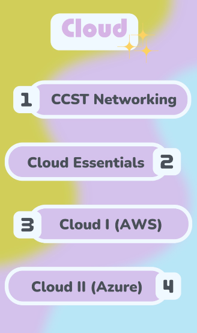

# Cloud Essentials

This comprehensive course is designed to equip learners with the fundamental knowledge and skills necessary to navigate the dynamic landscape of modern IT infrastructure and cloud services. By the end of this course, you will have a strong foundation in networking principles, a deep understanding of cloud computing concepts and services, proficiency in working with Microsoft Azure, familiarity with Google Cloud Platform, and the ability to make informed decisions when considering different cloud providers. This knowledge will prepare you for roles in cloud architecture, cloud administration, and cloud strategy, which are in high demand in the IT industry. 

Upon completing this course, participants will be equipped to: 
•	Develop a strong foundational knowledge of networking principles, including network devices and protocols, to establish a solid basis for cloud computing concepts.
•	Gain an in -depth understanding of cloud computing, covering key topics such as high availability (HA), scalability, elasticity, cost considerations (Capex vs. Opex), cloud service models (IaaS, SaaS, PaaS), and different cloud deployment models (public, private, hybrid).
•	Become proficient in **Microsoft Azure** cloud services, including Azure's hierarchy, registration, virtual machine (VM) configurations, virtual networks (VNETs), containers, storage, and databases.
•	Explore **Google Cloud Platform (GCP)** and understand how it compares to Microsoft Azure. Gain insights into GCP's networking, storage, and database services, enabling you to make informed decisions when choosing between cloud providers.
•	Gain awareness of **Amazon Web Services (AWS)** and understand its role in the cloud computing landscape. Conduct a comparative analysis of AWS with Microsoft Azure and Google Cloud to grasp the unique strengths and offerings of each provider.

| Cloud Essentials  |       |
| ----------------- | ----- |
| Final Online Exam | 40%   |
| Final LAB Exam    | 60%   |
| TOTAL             | 100%* |

*Min to pass: 70%

## Chronogram
 
### Week 1
Welcome and ANKI access
Networking Foundation

### Week 2
Virtualization Foundation   
                                            
### Week 3
Review Virtualization Foundation

### Week 4
Linux Foundation Part 1

### Week 5
Linux Foundation Part 2

### Week 6
What is cloud computing?

### Week 7
Azure Part 1

### Week 8
Azure Part 2

### Week 9  
GCP Part 1

### Week 10  
GCP Part 2

### Week 11  
AWS Part 1

### Week 12  
AWS Part 2

### Week 13  
Practice and active exam in ANKI

### Week 14
Final Practice lab exam

### Week 15
Final LAB exam
