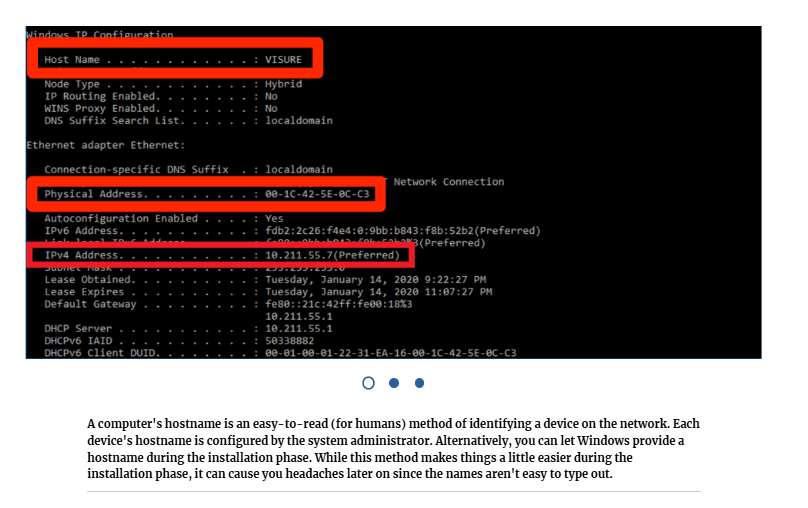
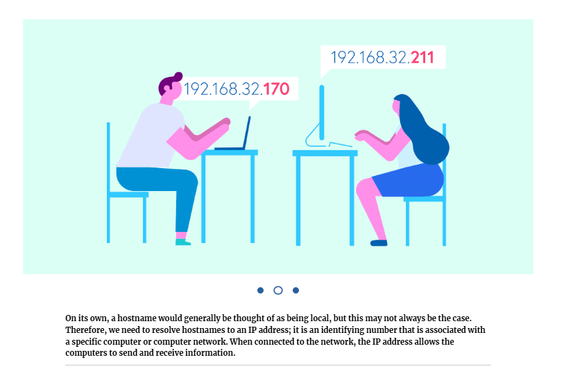
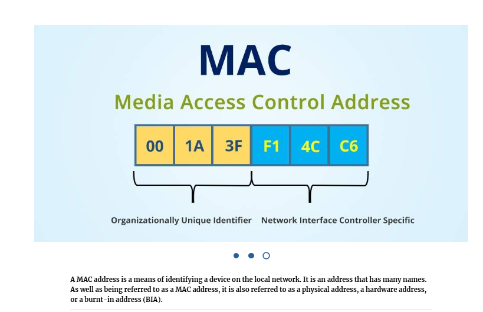
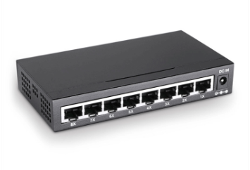
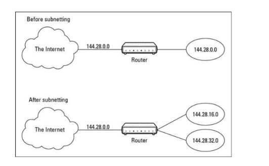

**Week 1**
* Welcome and ANKI access
* Networking Foundation
    - 1/4 Understanding a Network
    - 2/4 Overview of Switching and Routing
    - 3/4 Common Protocols used on Networking
    - 4/4 Subnetting Overview

# Networking Foundation

# 1/4 Understanding a Network
By Foundever Costa Rica
Foundever Costa Rica
## What Is a Network?

Depends on whom you ask. A person with a strong telecommunications background will tell you a network consists of PBXs, tie trunks, adjunct systems, PRI lines, T1s, handsets, and miles of fiber and copper cable. A person with a strong data background will probably tell you a network is made up of workstations, servers, routers, WAN connections, hubs, switches. In essence, both the telco and data people are right; however, for the purposes of this discussion, this chapter concentrates on data networks.

In its simplest form, a data network is a means to connect two or more computer systems for the purposes of sharing information. Networks come in all shapes and sizes: from two home PCs connected with a single cable to the colossal Internet, spanning the globe and connecting millions of distributed systems. 

<!-- Despite the extreme differences between various network installations, you can generally define a given network in terms of its architecture, topology, and protocol. -->

**Network architectures are divided into two types: local area networks (LANs) and wide area networks (WANs).**

The Internet is by far the largest WAN in existence. With the advent of wireless networking, optical, and cellular technology, the lines between LANs and WANs sometimes blur, merging seamlessly into a single network entity. Recently, more terms have been added to better classify and describe network architectures:

A private network belonging to an organization that is only accessible to authorized users.

#### Intranet
A private network belonging to an organization that is only accessible to authorized users.
#### Extranet
It is a controlled private network that allows access to partners, vendors, and suppliers or an authorized set of customers 
#### Internet
The network connecting hundreds of millions of systems and users on a global scale.
#### SAN (Storage Area Network)
A high-speed network connecting a variety of storage-related devices such as RAID arrays, tape systems, file servers, and so on
#### VLAN (Virtual Local Area Network)
A network allowing systems on separate physical networks to communicate as if they were connected to the same physical network.

A LAN can be described as something that covers a small geographical area that's small enough that the devices can be classed as being local to each other, most modern LANs will usually be a combination of wired and wireless devices.

When communication takes place between devices on a LAN, there is a requirement to identify and thus differentiate between the devices on the network, this is accomplished thanks to the hostnames, MAC addresses, and IP addresses.

<!-- 3 pictures -->

On the next session, we will cover the basics of Switching and Routing

---

# 2/4 Overview of Switching and Routing
By Foundever Costa Rica
Foundever Costa Rica
In networking, a switch is a device that receives incoming packets of information from the network and determines where each packet should be sent. In that sense, a network switch is more like a railroad track switch than a light switch. Instead of turning something on or off, a network switch determines which of several tracks a particular packet of information should be sent to.

The network switch keeps track of which device is attached to each of its ports. When a packet arrives on a network port, the switch looks at the recipient’s address contained in the packet. The switch then determines which port the recipient is on and sends the packet to that port.

8-port unmanaged Switch

Consider a small switch with eight ports, numbered 1 through 8. When the switch is powered on, it pays attention to the devices that it can connect to on each of its eight ports. It does this by studying the Ethernet packets that arrive on each port and taking note of the sender’s address contained in each packet.

### General Benefits of Network Switching

There are two reasons for switches being included in network designs. First, a switch breaks one network into many small networks so the distance and repeater limitations are restarted. Second, this same segmentation isolates traffic and reduces collisions relieving network congestion. It is very easy to identify the need for distance and repeater extension, and to understand this benefit of network switching. 

**Benefits or advantages of Switches:**
➨They increase the available bandwidth of the network.
➨They help in reducing workload on individual host PCs.
➨They increase the performance of the network.
➨Networks which use switches will have less frame collisions.
➨Switches can be connected directly to workstations.

**Drawbacks or disadvantages of Switches:**
➨They are more expensive compare to network bridges.
➨Network connectivity issues are difficult to be traced through the network switch.
➨Broadcast traffic may be troublesome.
➨If switches are in promiscuous mode, they are vulnerable to security attacks e.g. spoofing IP address or capturing of ethernet frames.
➨Proper design and configuration is needed in order to handle multicast packets.
➨While limiting broadcasts, they are not as good as routers.

## What is routing?

It is a process of transferring data from one network to another as IP packets. By default, hosts of different networks cannot communicate with each other. If two hosts located in different IP networks want to communicate with each other, they use IP routing.

Routers use a routing protocol for the following purposes.

* To figure out all available paths of the network. A router stores these paths in a table known as the routing table.
* To select the best and fastest path to get a destination host. 
When a router receives an IP packet, the router checks its routing table and compares all available paths to get the destination network of the received IP packet and selects the fastest path from all available paths.

Below you will see some a small exercise, the task is simple, sort out which statements refers to advantages, and which to disadvantages when referring to Static Routing.

The same for Dynamic routing

<!--! sorting activity -->

On the next session, we will review information related to common protocols used on networking

---

# 3/4 Common Protocols used on Networking
By Foundever Costa Rica
Foundever Costa Rica

In simple words, network protocols can be equated to languages that two devices must understand for seamless communication of information, regardless of their infrastructure and design disparities.

The functions of protocols are quite essential in the process of Networking. There are a number of protocols that exist and are used for various purposes. In fact, each of the protocol has been developed keeping in mind a particular situation or problem. Sometimes more than one protocols work together to achieve their task.

<!-- process with pictures -->
### Protocol 1 - TCP also referred to as "Transmission Control Protocol"
TCP is one of the most important protocols that function at the transport layer of the OSI Model. The primary task of TCP is to enable the smooth flow of data and its automatic recovery as well. It works on the principle of a Three-way handshake and gathers all the required information before establishing a connection.

### Protocol 2 - (TLS) Transport Layer Security
It is basically a protocol that is used to add security to a conversation. Whenever there is a communication between the client and the server, TLS makes sure that the data is secure and no one is able to intercept it. 

### Protocol 3 - UDP usually known as "User Datagram Protocol"
It is involved in the Transport Layer of the OSI Model. It is a connectionless protocol that enables the transfer of data over the network. However, UDP does not ensure that the data arrives at its destination perfectly without any error.

### Protocol 4 - DHCP is the abbreviation of "Dynamic Host Configuration Protocol"
DHCP is a protocol that allows the server to allocate an IP Address to every client or computer on the network automatically. This means that whenever a computer joins a DHCP server, it will automatically be given an IP address.

### Protocol 5 - DNS is called "Domain Name System"
DNS consists of a relational database that matches the names of different domains to their respective IP Addresses. This ensures that each of the IP Address on the network is given a particular name which is easily accessible.

### Protocol 6 - FTP is the abbreviation of "File Transfer Protocol"
It works at the Application Layer of the OSI Model. The basic purpose of FTP is to enable the transfer of files from remote hosts. It provides the facility to download and upload files on the remote server which is running FTP server software.

### Protocol 7 - HTTP/HTTPS
It is an application protocol for distributed, collaborative, hypermedia information systems that allows users to communicate data on the World Wide Web.

### Protocol 8 - Secure Shell (SSH)
Operates on the Application layer of the TCP/IP Model. Its basic purpose is to allow the users to access data remotely from a server. The users have the privilege to log on to a computer remotely and perform a number of tasks such as the download, modification, or deletion of data.

### Protocol 9 - RDP or Remote Desktop Protocol
It is a proprietary protocol developed by Microsoft which provides a user with a graphical interface to connect to another computer over a network connection. 

Moving into the last topic of this lesson, we will now talk about subnetting

----

# 4/4 Subnetting Overview
By Foundever Costa Rica
Foundever Costa Rica
What is a Subnet?

A subnet is a network that falls within a Class A, B, or C network. Subnets are created by using one or more of the Class A, B, or C host bits to extend the network ID. Thus, instead of the standard 8-, 16-, or 24-bit network ID, subnets can have network IDs of any length.

### Video
Intro to IPv4 Subnetting
[click to watch the video](./images/https://www.youtube.com/watch?v%3DUCoVs1Ri1IA)

The illustration below shows an example of a network before and after subnetting has been applied. In the unsubnetted network, the network has been assigned the Class B address 144.28.0.0. All the devices on this network must share the same broadcast domain.

In the second network, the first four bits, of the host ID, are used to divide the network into two small networks, identified as subnets 16 and 32. To the outside world (that is, on the other side of the router), these two networks still appear to be a single network identified as 144.28.0.0.

For example, the outside world considers the device at 144.28.16.22 to belong to the 144.28.0.0 network. As a result, a packet sent to this device will be delivered to the router at 144.28.0.0. The router then considers the subnet portion of the host ID to decide whether to route the packet to subnet 16 or subnet 32.

# quiz
check file: [tex019 quiz 6 questionst](./images/<019 quiz 6 questions.md>)