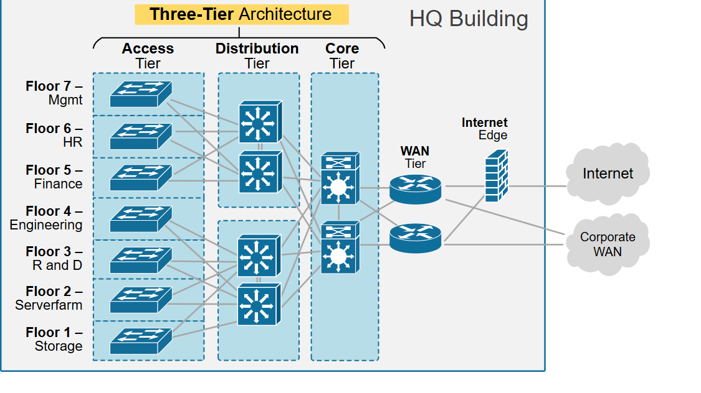
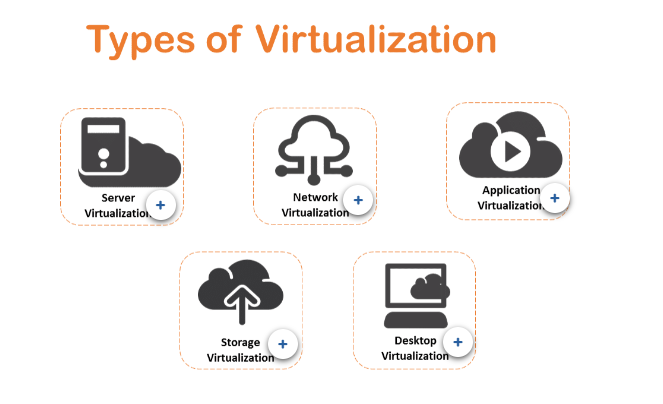
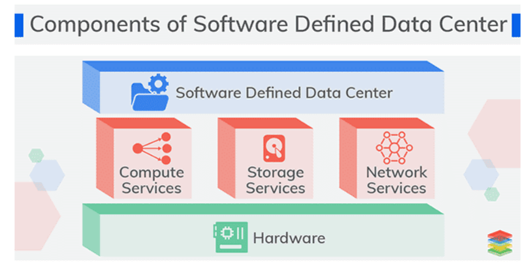

- Traditional DataCenter
- Virtualization Overview
- Software-Define Data Center (SDDC)

# Traditional DataCenter
By Foundever Costa Rica
## Traditional Data Center Overview

Data centers are at the center of modern software technology, serving a critical role in the expanding capabilities for enterprises. 

Whereas businesses just a few decades ago relied on error-prone paper-and-pencil documentation methods, data centers have vastly improved the usability of data as a whole. They’ve enabled businesses to do much more with much less, both in terms of physical space and the time required to create and maintain data. But data centers are positioned to play an even more important role in the advancement of technology with new concepts entering the landscape that represents a dramatic shift in the way data centers are conceived, configured, and utilized.

> *The traditional data center, also known as a “siloed” data center, relies heavily on hardware and physical servers.*

There are **two deployments models** used on the traditional data center:

### On-Premises Solutions (CPE - Customer Premises Equipment)
* All equipment is located in your building.
* All equipment is owned by you.
* Everything is the building is your responsibility.
* Equipment is CapEx.
* Long deploy times for new equipment.
* Equipment requires technology refreshers.
* Redundancy must be considered.

### Colocation or "Colo" Services
* A data center location where the owner of the facility rents out space to external customers.
* The facility owner provides power, cooling, physical security to customer's equipment.
* Your user's desktop will still be in your offices.
* The connection between your office and the colo is your ISP responsibility.
* Your equipment at Colo Facility is CapEx cost.
* Monthly Colo fees are OpEx expenses.

### *VIDEO* 10 Things to Look for in a Colocation Provider
[10 Things to Look for in a Colocation Provider](https://www.youtube.com/watch?v%3DaQ8QE7gTt8g)

## CapEx and OpEx?

Businesses have a variety of expenses, from the rent they pay for their factories or offices to the cost of raw materials for their products, to the wages they pay their workers to the overall costs of growing their business. 

To simplify all of these costs, businesses organize them under different categories. Two of the most common are **capital expenditures (CAPEX) and operating expenses (OPEX)**.

* Capital expenditures (CAPEX) are a company's major, long-term expenses while operating expenses (OPEX) are a company's day-to-day expenses.
* Examples of CAPEX include physical assets, such as buildings, equipment, machinery, and vehicles. 
* Examples of OPEX include employee salaries, rent, utilities, property taxes, and cost of goods sold (COGS).
* Capital expenditures cannot be deducted from income for tax purposes while operating expenses can be deducted from taxes.

## The Traditional Data Center Network

In traditional large data centers, the network is usually a three-tier structure called: a hierarchical internetworking model. 

This model contains the following three layers:

**Access Layer**
Controls user and workgroup access to the resources on the network. This layer usually incorporates Layer 2 switches and access points that provide connectivity between workstations and servers. You can manage access control and policy, create separate collision domains, and implement port security at this layer.
**Distribution layer**
Serves as the communication point between the access layer and the core. Its primary functions are to provide routing, filtering, and WAN access and to determine how packets can access the core. 
This layer determines the fastest way that network service requests are accessed – for example, how a file request is forwarded to a server – and, if necessary, forwards the request to the core layer. This layer usually consists of routers and multilayer switches.
It is sometimes called the Aggregation Layer
**Core Layer**
Also referred to as the network backbone, this layer is responsible for transporting large amounts of traffic quickly. The core layer provides interconnectivity between distribution layer devices it usually consists of high speed devices, like high end routers and switches with redundant links.

The main **benefits of Three-Layer hierarchical** model is that it helps to design, deploy and maintain a scalable, trustworthy, cost effective hierarchical internetwork.
• Better Performance: Allows in creating high performance networks
• Better Redundancy: Multiple links across multiple devices provides better redundancy. 
• Better Scalability: Allows us to efficiently accomodate future growth.
• Better Filter/Policy creation and application: Allows better filter/policy creation application.
• Better management & troubleshooting: CAllows better network management and isolate causes of network trouble.

> *Next Topic, Virtualization and SDCC*

---

# Virtualization Overview

## What is Virtualization?
Virtualization is the process of running a virtual instance of a computer system in a layer abstracted from the actual hardware. 

Most commonly, it refers to running multiple operating systems on a computer system simultaneously.

A major challenge in IT today is that organizations can easily spend 70 percent to 80 percent of their budgets on operations, including optimizing, maintaining, and manipulating the environment.

## Why is virtualization used?
There are many reasons why people utilize virtualization in computing. To desktop users, the most common use is to be able to run applications meant for a different operating system without having to switch computers or reboot into a different system. 

For administrators of servers, virtualization also offers the ability to run different operating systems, but perhaps, more importantly, it offers a way to segment a large system into many smaller parts, allowing the server to be used more efficiently by a number of different users or applications with different needs. 

It also allows for isolation, keeping programs running inside of a virtual machine safe from the processes taking place in another virtual machine on the same host.

### *VIDEO* Virtualization Explained
[Virtualization Explained](https://www.youtube.com/watch?v%3DFZR0rG3HKIk)

- Type1 Hypervisor: bare metal (VMware, hyper-V, KVM)
- Type2 Hypervisor: Hosted (VirtualBox)

**Benefits:**
* cost savings
* agility + speed
* lower downtime

> *"Virtualization is a foundational element of cloud computing and helps deliver on the value of cloud computing"*

---

## Types of Virtualization

### Server Virtualization
Server virtualization allows for many virtual machines to run on one physical server. The virtual servers share the resources of the physical server, which leads to better utilization of the physical servers resources. 
The resources that the virtual machines share are CPU, memory, storage, and networking. 
All of these resources are provided to the virtual machines through the hypervisor of the physical server.

### Network virtualization
Network virtualization is using software to perform network functionality by decoupling the virtual networks from the underlying network hardware. 
Once you start using network virtualization, the physical network is only used for packet forwarding, so all of the management is done using the virtual or software-based switches.

### Application virtualization
Application virtualization uses software to package an application into a “single executable and run anywhere” type of application.
The software application is separated from the operating system and runs in what is referred to as a “sandbox.” 
Virtualizing the application allows things like the registry and configuration changes to appear to run in the underlying operating system, although they really are running in the sandbox.

### Storage virtualization
Storage virtualization is the process of grouping physical storage using software to represent what appears to be a single storage device in a virtual format. 
Correlations can be made between storage virtualization and traditional virtual machines, since both take physical hardware and resources and abstract access to them. 
There is a difference between a traditional virtual machine and a virtual storage.  The virtual machine is a set of files, while virtual storage typically runs in memory on the storage controller that is created using software.

### Desktop Virtualization
The virtualization of the desktop, which sometimes is referred to as Virtual Desktop Infrastructure (VDI), is where a desktop operating system (OS), such as Windows 7, will run as a virtual machine on a physical server with other virtual desktops.

---

## Let's get to work

In the next section, you will deploy your first Virtual Machine using a Type2 Hypervisor, in order to complete this task, just follow the instruction displayed below

*VIDEO*
[How to install Ubuntu 22.10 LTS in VirtualBox 2026](https://www.youtube.com/watch?v%3DhYaCCpvjsEY)

Video taken from TopNotch Programmer 

# Software-Define Data Center (SDDC)

*VIDEO*
[The Software-Defined Data Center](https://www.youtube.com/watch?v%3DJf0KdjpxgCI)

Since the introduction of server virtualization years ago, organizations have recognized the value of pooling infrastructure resources. By abstracting compute resources from physical servers, server virtualization helps speed provisioning, improve system utilization, and reduce hardware expenditures.

Let's see some of the benefits of SDDC

### Virtualization and hybrid cloud extensibility
**SDDC can be extended out to public and private cloud services. It’s a bedrock of the hybrid cloud datacenter.**
The virtualization element of SDDC enables you to:
* Fully utilize your data center resources, as a virtualized pool you can allocate flexible to various workloads
* Build a hybrid cloud and gain its many economic and scalability advantages
* Centralize and simplify management

### Streamlined, automated datacenter operations
**Because resources are controlled by software, you can also automate routine tasks**
When your business streamlines and automates operations with SDDC, you can:
* Reduce management costs and effort
* Provision OSes, storage, networking and applications without manual intervention
* Use open standards to integrate management software and manage infrastructure with fewer tools

### Automated application infrastructure and delivery
**You have one application infrastructure to deploy to, and one to manage.**
Depending on the level of privilege, you or your user can do task like:
* Deploy new applications faster
* Offer policy-based application self-service for end-users
* Reduce the cost of application deployment

### Security that protects changing infrastructure
**Today, our applications are highly distributed and the perimeter is becoming increasingly harder to define.**
The situation has become increasingly complex, and complexity is the enemy of security.
With SDDC you can:
* Secure your infrastructure natively applying policies at the VM level shifting security from perimeter defence to one that is fine-grained and application & data centric
* Secure your data-at-rest with encryption
* Use micro-segmentation to embed a firewall within every VM, greatly reducing the risk of a breach and minimizing the impact.
* Ensure security policies follow the applications rather than the other way around making security truly persistent

### Resilient, high availability infrastructure
**Any data center is only as reliable as its hardware and the applications that run on it**
The advantage of SDDC is that single, virtualized pool of resources. If one server goes down, its resources disappear from the pool – but workloads can be allocated to another server.
There are storage availability benefits too. With the right backup or disaster recovery (DR) solution, you can keep multiple copies of critical data available across your entire infrastructure at all times. If one piece of storage goes down, the backup is still available to users. 

---

The SDDC results from years of evolution in server virtualization. It extends virtualization from compute to storage and networking resources, and it provides a single software toolset to manage those virtualized resources. 

SDDC enables policy-driven automation of provisioning and management, which speeds the delivery of resources and enhances efficiency.

