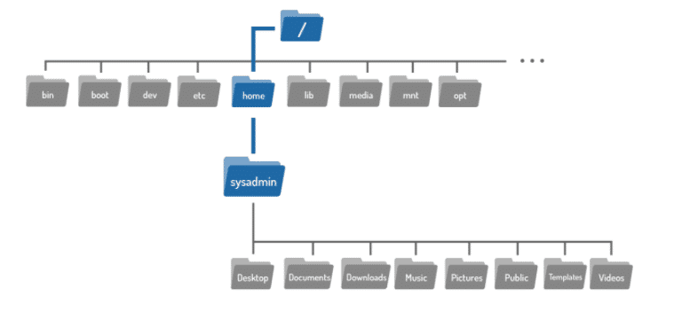
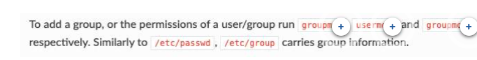

**Week 4**
Linux Foundation Part 1

- Linux Overview
- Navigating Basic Command Syntax
- To navigate the filesystem structure, use the cd (change directory) command to change directories.
- Administrative Access: create user, password


# Linux Overview (not interesting for the exam, but good to know)
By Foundever Costa Rica
Foundever Costa Rica

**From smartphones to cars, supercomputers and home appliances, home desktops to enterprise servers, the Linux operating system is everywhere.**

## What is Linux?

Just like Windows, iOS, and Mac OS, Linux is an operating system. In fact, one of the most popular platforms on the planet, Android, is powered by the Linux operating system. An operating system is software that manages all of the hardware resources associated with your desktop or laptop. To put it simply, the operating system manages the communication between your software and your hardware. Without the operating system (OS), the software wouldn't function.

The Linux operating system comprises several different pieces:

- Bootloader - The software that manages the boot process of your computer. For most users, this will simply be a splash screen that pops up and eventually goes away to boot into the operating system.

- Kernel - This is the one piece of the whole that is actually called ?Linux?. The kernel is the core of the system and manages the CPU, memory, and peripheral devices. The kernel is the lowest level of the OS.

- Init system - This is a sub-system that bootstraps the user space and is charged with controlling daemons. One of the most widely used init systems is systemd, which also happens to be one of the most controversial. It is the init system that manages the boot process, once the initial booting is handed over from the bootloader.

- Daemons - These are background services (printing, sound, scheduling, etc.) that either start up during boot or after you log into the desktop.

- Graphical Server - This is the sub-system that displays the graphics on your monitor. It is commonly referred to as the X server or just X.

- Desktop Environment - This is the piece that the users actually interact with. There are many desktop environments to choose from (GNOME, Cinnamon, Mate, Pantheon, Enlightenment, KDE, Xfce, etc.). Each desktop environment includes built-in applications (such as file managers, configuration tools, web browsers, and games).

- Applications -  Desktop environments do not offer the full array of apps. Just like Windows and macOS, Linux offers thousands upon thousands of high-quality software titles that can be easily found and installed.


**Linux has evolved into one of the most reliable computer ecosystems on the planet. Combine that reliability with zero cost of entry.**


## Why use Linux?

Linux is distributed under an open source license. Open source follows these key tenants:

* The freedom to run the program, for any purpose.
* The freedom to study how the program works, and change it to make it do what you wish.
* The freedom to redistribute copies so you can help your neighbor.
* The freedom to distribute copies of your modified versions to others.

These points are crucial to understanding the community that works together to create the Linux platform.

*Linux has a number of different versions to suit any type of user. From new users to hard-core users, you’ll find a “flavor” of Linux to match your needs.*

These versions are called **distributions**


# Navigating Basic Command Syntax
By Foundever Costa Rica
Foundever Costa Rica

## Basic Command Syntax

This module deals exclusively with the CLI or Command Line Interface, rather than a GUI or Graphical User Interface you may be familiar with. The CLI terminal is a powerful tool that is often the primary method used to administer small low-power devices, extremely capable cloud computing servers, and everything in between. 


*A basic understanding of the terminal is essential to diagnosing and fixing most Linux based systems.*

What is a command? A command is a software program that when executed on the CLI (command-line interface), performs an action on the computer. 

When you type in a command, a process is run by the operating system that can read input, manipulate data, and produce output. A command runs a process on the operating system, which then causes the computer to perform a job.

To execute a command, the first step is to type the name of the command.


* Use the "ls" command to know what files are in the directory you are in.
* An argument can be used to specify something for the command to act upon.
* Options can be used to alter the behavior of a command. 


## How much do you know?

Some of you may be familiar with linux, but some others are not. Let's see how good you do in the following exercise. 

Match each command to its description

*matching activity*

There are hundreds of commands to be used within the linux terminal; however, we will focus on those needed for daily operations of our systems

```sh
pwd # Use the pwd command to find out the path of the current working directory (folder) you’re in.
cd # To navigate through the Linux files and directories, use the cd command.
cat #  It is used to list the contents of a file on the standard output (sdout).
cp # Use the cp command to copy files from the current directory to a different directory.
mv # The primary use of the mv command is to move files, although it can also be used to rename files.
mkdir # Use mkdir command to make a new directory
man # It is used to display the user manual of any command that we can run on the terminal.
rm # The rm command is used to delete directories and the contents within them.
touch # The touch command allows you to create a blank new file through the Linux command line.
sudo # Short for “SuperUser Do”, this command enables you to perform tasks that require administrative or root permissions.
```

*Let's dive a bit more into each of the previous commands. More commands will be studied as we move forward within the course*

## Changing Directories

Files are used to store data such as text, graphics and programs. Directories are a type of file used to store other files–they provide a hierarchical organizational structure. The image below shows an abbreviated version of the filesystem structure on the virtual machines.

```sh
# To navigate the filesystem structure, use the cd (change directory) command to change directories.
cd [options] [path]
```



*If you look back at the graphic above, you will see the Documents directory is located within the home directory, where you are currently located. To move to the Documents directory, use it as argument to the cd command:*

If you think of the filesystem as a map, paths are the step-by-step directions; they can be used to indicate the location of any file within the filesystem. 

There are two types of paths: absolute and relative. Absolute paths start at the root of the filesystem, relative paths start from your current location.


### Absolute Paths
An absolute path allows you to specify the exact location of a directory. It always starts at the root directory, therefore it always begins with the / character. 
The following example shows how to change directory using absolute path
```sh
$pwd
/home/kt
$cd /home/kt/abc
$pwd
/home/kt/abc
```
### Relative Paths
A relative path gives directions to a file relative to your current location in the filesystem. Relative paths do not start with the / character, they start with the name of a directory. 

The following example shows how to change directory using relative path
```sh
$pwd
/home/kt
$cd abc
$pwd
/home/kt/abc
```


## Bash Shortcuts

[8 Bash Shortcuts Every Linux User Should Know](./images/https://www.youtube.com/watch?v%3DC-AQAJXdoS8)
*There are more shortcuts that can be used within the bash, make sure you research on them, and practice them.*
```sh
ctrl + c # Stop the current command
ctrl + d # Exit the terminal
tab # Auto-complete file and directory names
ctrl + l # Clear the terminal screen
up arrow # Scroll through previous commands
ctrl + a # Move the cursor to the beginning of the line
ctrl + e # Move the cursor to the end of the line
alt + f # Move the cursor forward one word
alt + b # Move the cursor backward one word
ctrl + r # Search through command history
ctrl + g # Exit the reverse search
```
**The Linux philosophy is "laugh in the face of danger". Oops. Wrong one. "Do it yourself". That's it.**
Linus Torvalds, Linux Creator


# Administrative Access
By Foundever Costa Rica
Foundever Costa Rica

## Users, Groups, Permissions

### What are users?

Users are the actors that do things in an OS. A user is responsible for invoking a program, has a list of unique attributes, and has certain permissions / restrictions.

Users can be people or non-people, but as far as the OS is concerned both are almost identical, but what does it mean non-people? It means “system users” like: Apache, Mailman, NTP.

When it comes to users, you will see that they have the following attributes

- **Username**
Usernames are what you call yourself as a user.

- **UID**
What your User is represented by in the OS. A unique identifier.
System users (robots) are UID 0-999, People users are UID 1000+

- **Group**
Groups allow multiple user to share permissions. Every user is usually in their own group and may be added to other groups for additional system access.

- **Home Directory (Usually but not always)**
Below is a line from the file /etc/passwd which stores user information (despite the name, it shouldn’t contain passwords).

- **Shell (not always interactive)**
This is the shell you are given when you login. Usually defaults to /bin/bash on GNU/Linux.
Robot users are not given a shell since they don’t login.

- **Password (Usually but not always)**
Most users have a password, but if one is not supposed to they can be given a wildcard password (*), which can never be matched, or an empty password, which is matched on empty input.


### What are groups?

A group is a collection of users. The main purpose of the groups is to define a set of privileges like read, write, or execute permission for a given resource that can be shared among the users within the group. 

Users can be added to an existing group to utilize the privileges it grants.





What is a sudoers or superusers?

**sudo** (Super User DO) command in Linux is generally used as a prefix of some command that only superuser are allowed to run. If you prefix “sudo” with any command, it will run that command with elevated privileges or in other words allow a user with proper permissions to execute a command as another user, such as the superuser. 

This is the equivalent of “run as administrator” option in Windows. The option of sudo lets us have multiple administrators.

These users who can use the sudo command need to have an entry in the sudoers file located at **“/etc/sudoers”.**

**Remember that to edit or view the sudoers file you have to use sudo command.**

Now that we have covers what users, groups and sudoers are, let's complete the following exercise on your machine

- [ ] Create a user on your system for yourself, with your preferred username.
- [ ] Give your user sudo powers.
- [ ] Change the password of the new user.
- [ ] Use su to get into the new user account.
- [ ] Create a directory called bootcamp in your home directory.
- [ ] Create a group called devops.


## Understanding Linux File Permissions

The concept of Linux File permission and ownership is crucial in Linux. Here, we will explain Linux permissions and ownership and will discuss both of them.

**Ownership of Linux files**

Every file and directory on your Unix/Linux system is assigned 3 types of owners

User: A user is the owner of the file. By default, the person who created a file becomes its owner. 

Group: A group can contain multiple users. All users belonging to a group will have the same Linux group permissions access to the file. 

Other: Any other user who has access to a file. This person has neither created the file, nor he belongs to a usergroup who could own the file. 

**Permissions**

Every file and directory in your UNIX/Linux system has following 3 permissions defined

Read: This permission give you the authority to open and read a file. 

Write: The write permission gives you the authority to modify the contents of a file. The write permission on a directory gives you the authority to add, remove and rename files stored in the directory. 

Execute: In Unix/Linux, you cannot run a program unless the execute permission is set. 


### Explore permissions on newly created files
Objective: Examine default behavior of newly created files

**Step 1**
Create a subdirectory in the /tmp with the same name as your username. For example, if your username is elvis, create the directory /tmp/elvis. This directory will hereafter be referred to as /tmp/ username.
**Step 2**
Compose a short list of new year's resolutions in your preferred text editor, or simply from the command line. Store the file in your newly created directory, as /tmp/username/resolutions.txt.

**Step 3**
Become one of your alternate user accounts. You may either login again from another virtual console, from a network connection, or simply su - to the alternate user.

**Step 4**
As the alternate user, confirm that you can view the file. Try adding an new item to the list. Why can you not modify the file as the alternate user?

End of Exercise
Let's wait for you peers to finish, and discuss with your instructor the results of the lab


In the previous section, we learned that files have three types of permissions ((r)ead, (w)rite, and e(x)ecute) and three classes of access ((u)ser, (g)roup, and (o)ther) that define how the file can be used. These permissions are managed by the chmod command. In Linux, the permissions of a file are often referred to as the "mode" of the file. 

The name **chmod** is a shortcut for change mode.

## Using chmod on files

The following table gives several examples of how the chmod command can be used to modify permissions of a file named foo, with default permissions of rw-rw-r--. 

The first column (second picture) is an example of the chmod command in use, and the last column (second picture) is the permissions that the file would have after running the command.

<!-- pictures -->


### Making a File Private
Objective: Change permissions on a file, such that others are not able to read the file.

**Step 1**
Create the directory /tmp/username, if it does not already exist. For example, if your username is elvis, create the directory /tmp/elvis.
**Step 2**
Create a simple list of resolutions in the file /tmp/username/resolutions.txt. You may use a text editor, your file from the previous lesson's exercise if it is still available, or simply create a new one.
**Step 3**
Permissions on a newly created file allow all users on the system to read the file. Assume that you want to keep your resolutions private. Modify the file's permissions, such that read access for others is removed.
**Step 4**
Using one of your alternate accounts, confirm that other users on the system are not able to read your resolutions.

How does this differ from the previous Lesson's Exercise?

End of Exercise
Let's wait for you peers to finish, and discuss with your instructor the results of the lab


### Updating User Passwords

The passwd command is used to update a user’s password. Users can only change their own passwords, whereas the root user can update the password for any user.

For example, if we are logged in as the sysadmin user we can change the password for that account. Execute the passwd command. You will be prompted to enter the existing password once and the new password twice.

```sh
passwd # Change the password of the current user interactively
passwd -S sysadmin # Get the current status of the user
```

<!-- pictures -->


