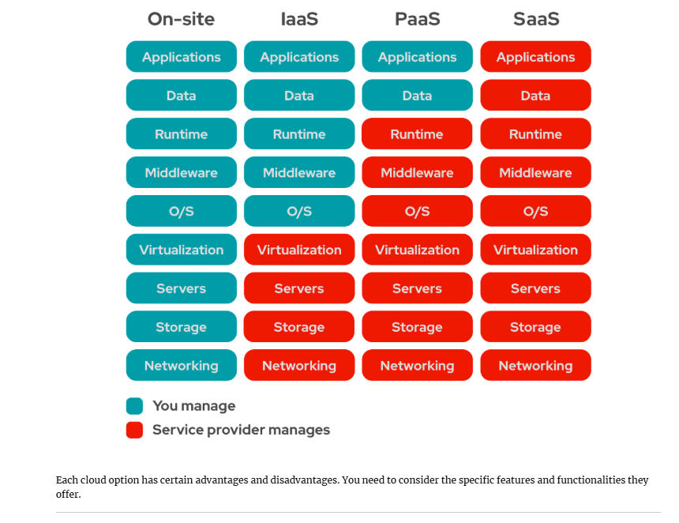
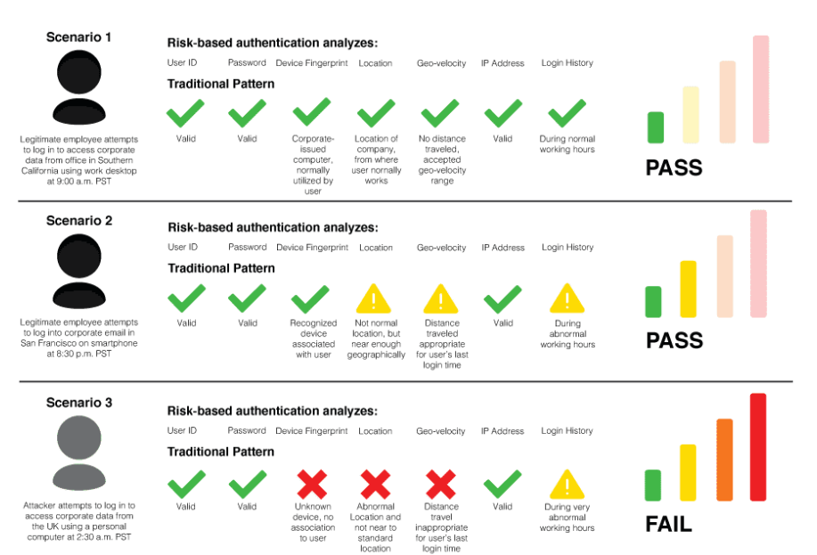

# Week 6: What is cloud computing?

Cloud computing is a model for enabling ubiquitous, convenient, on-demand network access to a shared pool of configurable computing resources

Cloud computing differs from traditional IT hosting services in that the consumer (whether that’s a business, organization, or individual user) generally doesn’t own the infrastructure needed to support the programs or applications they use.

Instead, those elements are owned and operated by a third party, and the end-user pays only for the services they use. In other words, cloud computing is an on-demand, utility-based model of computing.

In other words,  cloud computing is the delivery of computing services—including servers, storage, databases, networking, software, analytics, and intelligence—over the Internet (“the cloud”) to offer faster innovation, flexible resources, and economies of scale.

You typically pay only for cloud services you use, helping you lower your operating costs, run your infrastructure more efficiently, and scale as your business needs change.

[What is "The Cloud" as Fast As Possible](./images/https://www.youtube.com/watch?v%3DdsKIpLKo8AE)

# Types of cloud computing - Public Clouds, Private Clouds and Hybrid Clouds

When we show up to the present moment with all of our senses, we invite the world to fill us with joy. The pains of the past are behind us. The future has yet to unfold. But the now is full of beauty simply waiting for our attention.

Not all clouds are the same and not one type of cloud computing is right for everyone. Several different models, types, and services have evolved to help offer the right solution for your needs.

First, you need to determine the type of cloud deployment, or cloud computing architecture, that your cloud services will be implemented on. There are three different ways to deploy cloud services: on a public cloud, private cloud, or hybrid cloud.

**Public Clouds:** are owned and operated by a third-party cloud service providers, which deliver their computing resources, like servers and storage, over the Internet. Microsoft Azure is an example of a public cloud. With a public cloud, all hardware, software, and other supporting infrastructure is owned and managed by the cloud provider. You access these services and manage your account using a web browser.

**Private Clouds:** A private cloud refers to cloud computing resources used exclusively by a single business or organization. A private cloud can be physically located on the company’s on-site datacenter. Some companies also pay third-party service providers to host their private cloud. A private cloud is one in which the services and infrastructure are maintained on a private network.

**Hybrid Clouds:** Hybrid clouds combine public and private clouds, bound together by technology that allows data and applications to be shared between them. By allowing data and applications to move between private and public clouds, a hybrid cloud gives your business greater flexibility, more deployment options, and helps optimize your existing infrastructure, security, and compliance.

Advantages and Disadvantages of Cloud Computing
<!-- sorting activity -->

# Types of Cloud services

Cloud services are infrastructure, platforms, or software that are hosted by third-party providers and made available to users through the internet. Cloud services facilitate the flow of user data from front-end clients (e.g. users’ servers, tablets, desktops, laptops—any hardware on the users’ ends), through the internet, to the provider’s systems, and back. Users can access cloud services with nothing more than a computer, an operating system, and a network connection to the internet.

All infrastructure, platforms, software, or technologies that users access through the internet without requiring additional software downloads can be considered cloud services—including the following as-a-Service solutions.

Iaas
Paas
Saas

# TCO, Performance, Scaling and Authentication

What is TCO ?

TCO or **Total Cost of Ownership** It is a calculation that reveals the cost of owning a product or service for a given period. The calculation covers the total cost of acquisition and operation rather than just the acquisition.

Although the concept of the total cost of ownership has been around since the early twentieth century, it was popularized by the Gartner Group during the eighties. It is particularly relevant in information technology deployment decisions.

Let’s look at the factors that would be considered when new hardware and software are under consideration. What are the costs?
* Hardware and software to build the network
* Hardware and software needed to set up servers
* Hardware and software for individual work stations
* Cost of installing and integrating all these components
* Migration costs
* Any license fees to be paid

This list only covers getting the new system up and running, but there will be additional costs:
* What are the financial implications of glitches or failures?
* How often will the hardware or software be upgraded, and what would that cost?
* If support is needed, will it be available, and what costs would this incur?

Now that we have looked at the direct and obvious costs, the list of costs is still not complete:
* How much is the space the new system takes up worth?
* How will this affect utility costs? For example, cooling a complex server can be extremely expensive.
* If backup power systems have to be installed and maintained, what would they cost?
* What cybersecurity measures must be in place, what will they cost, and what are the cost implications of failure?
* Data must be backed up, and if there is a failure, it should be recoverable. This also has a price tag.
* Managers and staff must be trained to use the new systems. How costly will user adoption be?
* The new equipment must be insured. What will the premiums be?
* Will additional personnel be needed to support the new system?

Finally, we may believe we have reached the bottom line, but that’s not so.
* What if we want to upgrade or upscale?
* Eventually, we would have to replace the system, what is the projected replacement cost?
* When we decommission the system, what costs will we incur?

### Performance

There are several different aspects of designing high-performance computing in the traditional data center that can be a real challenge. 

The first of these is that by continually deploying faster and faster hardware over a number of years, you tend to mask technical debt.

When you're deploying high-performance computing, it's often gonna require custom networks, custom hardware, and segregation from the rest of your resources, which leads me to the next point. High-performance computing doesn't mix well with regular workloads.

It becomes really difficult to combine your standard applications with the high-performance computing infrastructure for when it's sitting idle. And finally, it becomes obsolete quickly. And this goes back to that first point that you need to purchase new hardware on a regular basis to stay current.

Architecting in the cloud is harder than architecting for an on-premise set of resources. There are no single best practices. You're not going to find a lot of reference architectures that are going to say this is the one and only way to deploy this particular application into the cloud. And because there are so many options, now you have the ability to let your application requirements determine the technology rather than the other way around.

You don't need to know what that rearchitected infrastructure needs to look like. All you need to know is the threshold. And finally, test everything. You're going to see a lot of documents online about theoretical maximums for particular services and features but until you've tested them on your application, in your infrastructure, you're not going to know how well it will perform

Now, what points are used to evaluate the performance of cloud solutions, see below

| Metrics                       | Description                                                                      |
| ----------------------------- | -------------------------------------------------------------------------------- |
| Service response time (delay) | The latency time between service request and service completion                  |
| Service throughput            | The number of jobs that can be processed by the service provider in a time unit  |
| Service **availability**      | The probability that a service request can be accepted by the service provider   |
| System **utilization**        | The percentage of system resources that are busy for service provisioning        |
| System **resilience**         | The stability of system performance over time especially under bursty loads      |
| System **scalability**        | The ability of a system to performance well when it is changed in size or volume |
| System **elasticity**         | The ability of a system to adapt to changes in its loads                         |

# Scalability
There are many reasons to make the move to the cloud, but one of the most common is scalability. What is scalability in cloud computing? Scalability is the ability to easily add or subtract compute or storage resources.

**In ‘the old days’ of on-premise data centers, scalability was incredibly costly, slow, and difficult to manage. Back then, scaling up meant buying new server hardware and disk arrays.**

That’s how resources were added to a traditional IT infrastructure. But what if you need fewer resources? In a real-world IT environment, demand isn’t steady. In a data center world, reducing capacity was almost never practical, so companies were left provisioning enough resources to cover their expected peak demand.

There are two ways to scale: vertically or horizontally. When you scale vertically, it’s often called scaling up or down. When you scale horizontally, you are scaling out or in.

**Cloud Vertical Scaling** refers to adding more CPU, memory, or I/O resources to an existing server, or replacing one server with a more powerful server. Amazon Web Services (AWS) vertical scaling and Microsoft Azure vertical scaling can be accomplished by changing instance sizes, or in a data center by purchasing a new, more powerful appliance and discarding the old one. AWS and Azure cloud services have many different instance sizes, so scaling vertically is possible for everything from EC2 instances to RDS databases.

**Cloud Horizontal Scaling** refers to provisioning additional servers to meet your needs, often splitting workloads between servers to limit the number of requests any individual server is getting. In a cloud-based environment, this would mean adding additional instances instead of moving to a larger instance size.

**"Sometimes scalability is erroneously used as a synonym for growth"**

In practice, scaling horizontally (or out and in) is usually the best practice. It’s much easier to accomplish without downtime—even in a cloud environment, scaling vertically usually requires making the application unavailable for some amount of time. Horizontal scaling is also easier to manage automatically, and limiting the number of requests any instance gets at one time is good for performance, no matter how large the instance.

There are essentially three ways to scale in a cloud environment: manually, scheduled, and automatic.

- **Manual scaling:** is just as it sounds. It requires an engineer to manage scaling-up/down or out/in. In the cloud, both vertical and horizontal scaling can be accomplished with the push of a button, so the actual scaling isn’t terribly difficult. 
- **Scheduled scaling:** solves some of the problems with manual scaling. Based on your usual demand curve, you can scale out to.
- **Automatic scaling:** (also known as autoscaling) is when your compute, database, and storage resources scale automatically based on predefined rules.

# Authentication vs Authorization

## Authentication

It is the process of **verifying that users are who they say they are.** Before you can access resources on most systems, you have to first authenticate yourself. Anytime sensitive information is involved or anytime auditing needs to be performed, you have to make sure the person performing an action is who they say they are. If you don’t, you can’t really trust that person or the information they provide. Many different methods can be used to authenticate someone or something. It’s important that you pick the right authentication method for a given situation.

Authentication is an important part of any environment. The cloud is no exception. In fact, in some aspects, authentication is even more important in a public cloud environment than in a traditional environment. Authentication is the primary method for restricting access to applications and data. Since public cloud applications are available via the Web, they can theoretically be accessed by anyone. For this reason, service providers need to ensure that they take the appropriate precautions to protect applications and user data. This process begins with ensuring that the appropriate authentication methods are in place.

### IDENTIFICATION VS. VERIFICATION

When you look at the issue of authentication, you can break it down into two components: identification and verification. I**dentification is the process of you stating who you are**. This statement could be in the form of a username, an email address, or some other method that identifies you. Basically, you are saying, “I am drountree” or “I am derrick@gmail.com,” and “I want access to the resources that are available to me.”

But how does the system know that you really are drountree? The system can’t just give access to anyone who claims to be drountree. This is where verification comes in. **Verification is the process that a system goes through to check that you are indeed who you say you are.** This is what most people think of when they think of authentication. They don’t realize that the first part of the process is that you first have to make a statement about who you are. Verification can be performed in many ways. You supply a password or a personal information number (PIN) or use some type of biometric identifier.

Think about it this way: You know that when you attempt to authenticate to a system and you enter your username and password, the system will check to see if the combination is right. A correct combination of the username and password is needed for successful authentication.

The system will first check to see that the username you entered is a valid username. If it isn’t, then an error message will immediately be returned.

### Advanced Authentication Methods

In securing your data applications, simple username and password authentication may not be sufficient. You should take extra care in situations where the identity of the person making a request may be especially questioned, such as external requests to internal systems.

#### Multifactor authentication

One method for ensuring proper authentication security is the use of multifactor authentication. Multifactor authentication gets its name from the use of multiple authentication factors. You can think of a factor as a category of authentication. 

There are three authentication factors that can be used: something you know, something you have, and something you are. 

- **Something you know** would be a password, a birthday, or some other personal information. 
- **Something you have** would be a one-time use token, a smartcard, or some other artifact that you might have in your physical possession. 
- **Something you are** would be your biometric identities, like a fingerprint or a speech pattern. 

In order for something to be considered multifactor authentication, it must make use of at least two of the three factors mentioned.

#### Risk-based authentication

Risk-based authentication has just started to gain popularity. Risk-based authentication actually came about because of the increased risk facing public applications and Web sites. Risk-based authentication uses a risk profile to determine whether the authentication request could be suspect. 

Each authentication attempt is given a risk score. If the risk score exceeds a certain value, the Web site or service provider can request additional information before allowing access. This additional information could be in the form of security questions or an additional authentication factor.

## AUTHORIZATION

After users have been authenticated, authorization begins. Authorization is the process of specifying what a user is allowed to do. Authorization is not just about systems and system access. Authorization is any right or ability a user has anywhere.

Every organization should have a security policy that specifies who is allowed to access which resources and what they are allowed to do with these resources. Authorization policies can be affected by anything from privacy concerns to regulatory compliance. It’s important that the systems you have in place are able to enforce the authorization policy of your organization; this includes public cloud-based systems.