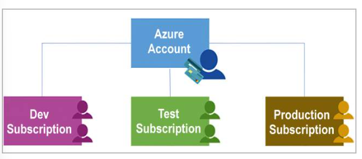
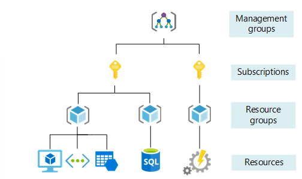
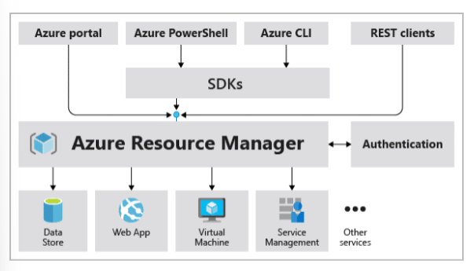
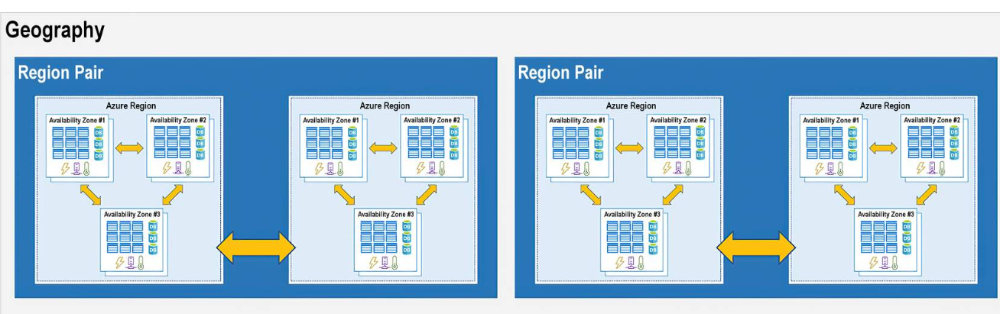

# Week 7 - Azure Part 1/3 - Core Concepts

- **Azure Fundamentals part 1: Core Concepts**
    - Azure Portal and MarketPlace
    - Azure subscriptions
    - Azure management groups
    - What are Azure Resource and Resource Manager?
    - Azure regions and availability zones

- **Azure Compute Services**
    - Azure Virtual Machines
    - Azure App 
    - Azure Functions

# Azure Fundamentals part 1: Core Concepts
By Foundever Costa Rica
Foundever Costa Rica
__Introduction__

Azure is a cloud computing platform with an ever-expanding set of services to help you build solutions to meet your business goals. Azure services range from simple web services for hosting your business presence in the cloud to running fully virtualized computers for you to run your custom software solutions.

__What does Azure offer?__

With help from Azure, you have everything you need to build your next great solution. The following table lists several of the benefits that Azure provides, so you can easily invent with purpose.

1. Build on your terms: You have choices. With a commitment to open source, and support for all languages and frameworks, build how you want and deploy where you want to.

2. Operate hybrid seamlessly: On-premises, in the cloud, and at the edge--we'll meet you where you are. Integrate and manage your environments with tools and services designed for a hybrid cloud solution.

3. Trust your cloud: Get security from the ground up, backed by a team of experts, and proactive compliance trusted by enterprises, governments, and startups.

__How does Azure work?__

https://www.youtube.com/watch?v=lXFly6w-

# Azure Portal and MarketPlace

## What is the Azure portal?

The Azure portal is designed for resiliency and continuous availability.

The Azure portal is a web-based, unified console that provides an alternative to command-line tools.

With the Azure portal, you can manage your Azure subscription by using a graphical user interface. You can:

* Build, manage, and monitor everything from simple web apps to complex cloud deployments.
* Create custom dashboards for an organized view of resources.
* Configure accessibility options for an optimal experience.

The Azure portal resilient to individual datacenter failures and avoids network slowdowns by being close to users. The Azure portal updates continuously and requires no downtime for maintenance activities.

## What is Azure Marketplace?

It helps connect users with Microsoft partners, independent software vendors, and startups that are offering their solutions and services, which are optimized to run on Azure. Azure Marketplace customers can find, try, purchase, and provision applications and services from hundreds of leading service providers. All solutions and services are certified to run on Azure.

https://www.youtube.com/watch?v=

The solution catalog spans several industry categories such as open-source container platforms, virtual machine images, databases, application build and deployment software, developer tools, threat detection, and blockchain. Using Azure Marketplace, you can provision end-to-end solutions quickly and reliably, hosted in your own Azure environment. At the time of writing, there are more than 8,000 listings.

Azure Marketplace is designed for IT pros and cloud developers interested in commercial and IT software. Microsoft partners also use it as a launch point for all joint go-to-market activities.

# Azure architectural components

## Azure subscriptions

An Azure **subscription is a logical unit of Azure services** that links to an Azure account, which is an identity in Azure Active Directory (Azure AD) or in a directory that Azure AD trusts

Limits should be considered as you create subscriptions on your account.

A subscription provides you with authenticated and authorized access to Azure products and services. It also allows you to provision resources.
Subscriptions are bound to some hard limitations. For example, the maximum number of Azure ExpressRoute circuits per subscription is 10. If there's a need to go over those limits in particular scenarios, you might need additional subscriptions.

## Azure management groups

If your organization has many subscriptions, you might need a way to efficiently manage access, policies, and compliance for those subscriptions. **Azure management groups provide a level of scope above subscriptions.** You organize subscriptions into containers called management groups and apply your governance conditions to the management groups.

Management groups give you enterprise-grade management at a large scale no matter what type of subscriptions you might have. All subscriptions within a single management group must trust the same Azure AD tenant.

Some Important facts about management groups

* 10,000 management groups can be supported in a single directory.
* A management group tree can support up to six levels of depth. This limit doesn't include the root level or the subscription level.
* Each management group and subscription can support only one parent.
* Each management group can have many children.
* All subscriptions and management groups are within a single hierarchy in each directory.

# What are Azure Resource and Resource Manager?

A resource is a manageable item that's available through Azure. Virtual machines (VMs), storage accounts, web apps, databases, and virtual networks are examples of resources.

## Azure resource groups

Resource groups are a fundamental element of the Azure platform. A resource group is a logical container for resources deployed on Azure. 

All resources must be in a resource group, and a resource can only be a member of a single resource group.

Resource groups exist to help manage and organize your Azure resources. By placing resources of similar usage, type, or location in a resource group, you can provide order and organization to resources you create in Azure.

## Azure Resource Manager

Azure Resource Manager is the deployment and management service for Azure. It provides a management layer that enables you to create, update, and delete resources in your Azure account. You use management features like access control, locks, and tags to secure and organize your resources after deployment.

When a user sends a request from any of the Azure tools, APIs, or SDKs, Resource Manager receives the request. It authenticates and authorizes the request. Resource Manager sends the request to the Azure service, which takes the requested action. Because all requests are handled through the same API, you see consistent results and capabilities in all the different tools.

The following image shows the role Resource Manager plays in handling Azure requests.

All capabilities that are available in the Azure portal are also available through PowerShell, the Azure CLI, REST APIs, and client SDKs.

### The benefits of using Resource Manager

* Manage your infrastructure through declarative templates rather than scripts. A Resource Manager template is a JSON file that defines what you want to deploy to Azure.
* Deploy, manage, and monitor all the resources for your solution as a group, rather than handling these resources individually.
* Redeploy your solution throughout the development life cycle and have confidence your resources are deployed in a consistent state.
* Define the dependencies between resources so they're deployed in the correct order.
* Apply access control to all services because RBAC is natively integrated into the management platform.
* Apply tags to resources to logically organize all the resources in your subscription.
* Clarify your organization's billing by viewing costs for a group of resources that share the same tag.

# Azure regions and availability zones

Azure is made up of datacenters located around the globe. When you use a service or create a resource such as a SQL database or virtual machine (VM), you're using physical equipment in one or more of these locations. 

These specific datacenters aren't exposed to users directly. Instead, Azure organizes them into regions. As you'll see later in this unit, some of these regions offer availability zones, which are different Azure datacenters within that region.

## Azure regions

A region is a geographical area on the planet that contains at least one but potentially multiple datacenters that are nearby and networked together with a low-latency network. Azure intelligently assigns and controls the resources within each region to ensure workloads are appropriately balanced.

Global map of available Azure regions as of June 2020.

These regions give you the flexibility to bring applications closer to your users no matter where they are. Global regions provide better scalability and redundancy. They also preserve data residency for your services.

## Azure availability zones

Availability zones are physically separate datacenters within an Azure region. Each availability zone is made up of one or more datacenters equipped with independent power, cooling, and networking. An availability zone is set up to be an isolation boundary. If one zone goes down, the other continues working. Availability zones are connected through high-speed, private fiber-optic networks.

Availability zones are primarily for VMs, managed disks, load balancers, and SQL databases. Azure services that support availability zones fall into two categories:

* Zonal services: You pin the resource to a specific zone (for example, VMs, managed disks, IP addresses).
* Zone-redundant services: The platform replicates automatically across zones (for example, zone-redundant storage, SQL Database).

## Azure region pairs

Each Azure region is always paired with another region within the same geography (such as US, Europe, or Asia) at least 300 miles away. This approach allows for the replication of resources (such as VM storage) across a geography that helps reduce the likelihood of interruptions because of events such as natural disasters, civil unrest, power outages, or physical network outages that affect both regions at once. 

Diagram showing the relationship between geography, region pair, region, and datacenter. The geography box contains two region pairs. Each region pair contains two Azure regions. Each region contains three availability zones.

If a region in a pair was affected by a natural disaster, for instance, services would automatically failover to the other region in its region pair.

Additional advantages of region pairs:

* If an extensive Azure outage occurs, one region out of every pair is prioritized to make sure at least one is restored as quickly as possible for applications hosted in that region pair.
* Planned Azure updates are rolled out to paired regions one region at a time to minimize downtime and risk of application outage.
* Data continues to reside within the same geography as its pair (except for Brazil South) for tax- and law-enforcement jurisdiction purposes.

Having a broadly distributed set of datacenters allows Azure to provide a high guarantee of availability.

# Azure Compute Services

Azure compute is an on-demand computing service for running cloud-based applications. It provides computing resources such as disks, processors, memory, networking, and operating systems. The resources are available on-demand and can typically be made available in minutes or even seconds. You pay only for the resources you use, and only for as long as you're using them.

### Azure Virtual Machines
With Azure Virtual Machines, you can create and use VMs in the cloud. VMs provide infrastructure as a service (IaaS) in the form of a virtualized server and can be used in many ways. Just like a physical computer, you can customize all of the software running on the VM. VMs are an ideal choice when you need:
* Total control over the operating system (OS).
* The ability to run custom software.
* To use custom hosting configurations.
An Azure VM gives you the flexibility of virtualization without having to buy and maintain the physical hardware that runs the VM. You still need to configure, update, and maintain the software that runs on the VM.

### Azure App 
App Service enables you to build and host web apps, background jobs, mobile back-ends, and RESTful APIs in the programming language of your choice without managing infrastructure. It offers automatic scaling and high availability. App Service supports Windows and Linux and enables automated deployments from GitHub, Azure DevOps, or any Git repo to support a continuous deployment model.
This platform as a service (PaaS) environment allows you to focus on the website and API logic while Azure handles the infrastructure to run and scale your web applications.
With App Service, you can host most common app service styles like:
Web apps
API apps
WebJobs
Mobile 

### Azure Functions
Serverless computing is the abstraction of servers, infrastructure, and operating systems. With serverless computing, Azure takes care of managing the server infrastructure and the allocation and deallocation of resources based on demand. Infrastructure isn't your responsibility. 
Scaling and performance are handled automatically. You're billed only for the exact resources you use. There's no need to even reserve capacity.
Azure has two implementations of serverless compute:
Azure Functions: Functions can execute code in almost any modern language.
Azure Logic Apps: Logic apps are designed in a web-based designer and can execute logic triggered by Azure services without writing any code.