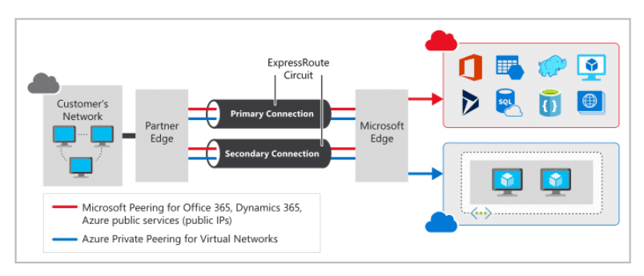

### Week 8 - Azure Part 2

- **Azure Fundamentals: Storage**
    - **Azure Storage Services:** Disk storage, Blob storage, Azure Files
    - **Azure Database Services:** Azure Cosmos DB, Azure SQL Database, Azure SQL Managed Instance, Azure database for MySQL, Azure Database for PostgreSQL

- **Azure Fundamentals: Network Services**
    - **What is Azure virtual networking?:** Isolation and segmentation, Internet communications, Communicate between Azure resources, Communicate with on-premises resources, Route network traffic, Filter network traffic, Connect virtual networks
    - **Azure VPN Gateway:** VPN gateways, Policy-based VPNs, Route-based VPNs, Azure ExpressRoute

# Azure Storage Services
It is a service that you can use to **store files, messages, tables, and other types of information**. Clients such as websites, mobile apps, desktop applications, and many other types of custom solutions can read data from and write data to Azure Storage. Azure Storage is also used by infrastructure as a service virtual machines, and platform as a service cloud services.
To begin using Azure Storage, you first create an Azure Storage account to store your data objects. You can create an Azure Storage account by using the Azure portal, PowerShell, or the Azure CLI.

### Disk storage
**Disk Storage provides disks for Azure virtual machines**. Applications and other services can access and use these disks as needed, similar to how they would in on-premises scenarios. Disk Storage allows data to be persistently stored and accessed from an attached virtual hard disk.
Disks come in many different sizes and performance levels, from solid-state drives (SSDs) to traditional spinning hard disk drives (HDDs), with varying performance tiers.

### Blob storage
Azure **Blob Storage is an object storage solution for the cloud**. It can store **massive amounts of data, such as text or binary data**. Azure Blob Storage is unstructured, meaning that there are **no restrictions on the kinds of data it can hold.**
Blob Storage can manage thousands of simultaneous uploads, massive amounts of video data, constantly growing log files, and can be reached from anywhere with an internet connection.
Blob Storage is ideal for:
* Serving images or documents directly to a browser.
* Storing files for distributed access.
* Streaming video and audio.
* Storing data for backup and restore, disaster recovery, and archiving.
* Storing data for analysis by an on-premises or Azure-hosted service.
* Storing up to 8 TB of data for virtual machines.

### Azure Files
Azure Files offers fully **managed file shares** in the cloud that are accessible via the industry standard Server Message Block and Network File System (preview) protocols. Azure file shares can be mounted concurrently by cloud or on-premises deployments of Windows, Linux, and macOS. 
Typical usage scenarios would be to share files anywhere in the world, diagnostic data, or application data sharing. Use Azure Files for the following situations:
* Many on-premises applications use file shares. 
* Store configuration files on a file share and access them from multiple VMs. 
* Write data to a file share, and process or analyze the data later. 

**Azure Storage offers different access tiers for your blob storage**, helping you store object data in the most cost-effective manner. The available access tiers include:
- **Hot access tier:** Optimized for storing data that is accessed frequently (for example, images for your website).
- **Cool access tier:** Optimized for data that is infrequently accessed and stored for at least 30 days (for example, invoices for your customers).
- **Archive access tier:** Appropriate for data that is rarely accessed and stored for at least 180 days, with flexible latency requirements (for example, long-term backups).

## Azure Database Services
Azure offers a choice of fully managed relational, NoSQL, and in-memory databases, spanning proprietary and open-source engines, to fit the needs of modern app developers. 
Infrastructure management—including scalability, availability, and security—is automated, saving you time and money.

### Azure Cosmos DB
Azure Cosmos DB is a globally distributed, multi-model database service. You can elastically and independently scale throughput and storage across any number of Azure regions worldwide. 
Azure Cosmos DB supports schema-less data, which lets you build highly responsive and "Always On" applications to support constantly changing data.

### Azure SQL Database
Azure SQL Database is a **relational database** based on the latest stable version of the Microsoft SQL Server database engine. SQL Database is a high-performance, reliable, fully managed, and secure database. You can use it to build data-driven applications and websites in the programming language of your choice, without needing to manage infrastructure.
You can use advanced query processing features, such as high-performance, in-memory technologies and intelligent query processing.

### Azure SQL Managed Instance
Azure SQL Managed Instance is a scalable cloud data service that provides the broadest SQL Server database engine compatibility with all the benefits of a fully managed platform as a service. 
Like Azure SQL Database, Azure SQL Managed Instance is a platform as a service (PaaS) database engine, which means that your company will be able to take advantage of the best features of moving your data to the cloud in a fully-managed environment.

### Azure database for MySQL
Azure Database for MySQL is a **relational database** service in the cloud, and it's based on the MySQL Community Edition database engine, versions 5.6, 5.7, and 8.0. 
Azure Database for MySQL delivers:
Built-in high availability with no additional cost.
Predictable performance and inclusive, pay-as-you-go pricing.
Scale as needed, within seconds.
Ability to protect sensitive data at-rest and in-motion.
Automatic backups.
Enterprise-grade security and compliance.

### Azure Database for PostgreSQL
Azure Database for PostgreSQL is a **relational database** service in the cloud. The server software is based on the community version of the open-source PostgreSQL database engine. 
Moreover, Azure Database for PostgreSQL delivers the following benefits:
* Built-in high availability compared to on-premises resources. 
* Simple and flexible pricing. 
* Scale up or down as needed, within seconds. 
* Adjustable automatic backups and point-in-time-restore for up to 35 days.
* Enterprise-grade security and compliance to protect sensitive data at-rest and in-motion.

## What is Azure virtual networking?

Azure virtual networks enable Azure resources, such as VMs, web apps, and databases, to communicate with each other, with users on the internet, and with your on-premises client computers. You can think of an Azure network as a set of resources that links other Azure resources.

Azure virtual networks provide the following key networking capabilities:

- Isolation and segmentation
- Internet communications
- Communicate between Azure resources
- Communicate with on-premises resources
- Route network traffic
- Filter network traffic
- Connect virtual networks

Let's talk about each of those a bit more

Azure Networking capabilities

### Isolation and segmentation
Virtual Network allows you to create multiple isolated virtual networks. When you set up a virtual network, you define a private IP address space by using either public or private IP address ranges. You can divide that IP address space into subnets and allocate part of the defined address space to each named subnet.

For name resolution, you can use the name resolution service that's built in to Azure. You also can configure the virtual network to use either an internal or an external DNS server.

### Internet communications
A VM in Azure can connect to the internet by default. You can enable incoming connections from the internet by defining a public IP address or a public load balancer. For VM management, you can connect via the Azure CLI, Remote Desktop Protocol, or Secure Shell.

### Communicate between Azure resources
You'll want to enable Azure resources to communicate securely with each other. You can do that in one of two ways:

**Virtual networks**
Virtual networks can connect not only VMs but other Azure resources, such as the App Service Environment for Power Apps, Azure Kubernetes Service, and Azure virtual machine scale sets.

**Service endpoints**
You can use service endpoints to connect to other Azure resource types, such as Azure SQL databases and storage accounts. This approach enables you to link multiple Azure resources to virtual networks to improve security and provide optimal routing between resources.

### Communicate with on-premises resources
Azure virtual networks enable you to link resources together in your on-premises environment and within your Azure subscription. In effect, you can create a network that spans both your local and cloud environments. There are three mechanisms for you to achieve this connectivity:

- **Point-to-site virtual private networks**
This approach is like a virtual private network (VPN) connection that a computer outside your organization makes back into your corporate network, except that it's working in the opposite direction. In this case, the client computer initiates an encrypted VPN connection to Azure to connect that computer to the Azure virtual network.

- **Site-to-site virtual private networks**
A site-to-site VPN links your on-premises VPN device or gateway to the Azure VPN gateway in a virtual network. In effect, the devices in Azure can appear as being on the local network. The connection is encrypted and works over the internet.

- **Azure ExpressRoute**
For environments where you need greater bandwidth and even higher levels of security, Azure ExpressRoute is the best approach. ExpressRoute provides dedicated private connectivity to Azure that doesn't travel over the internet. (You'll learn more about ExpressRoute in a separate unit later in this module.)

### Route network traffic
By default, Azure routes traffic between subnets on any connected virtual networks, on-premises networks, and the internet. You also can control routing and override those settings, as follows:

**Route tables**
A route table allows you to define rules about how traffic should be directed. You can create custom route tables that control how packets are routed between subnets.

**Border Gateway Protocol**
Border Gateway Protocol (BGP) works with Azure VPN gateways or ExpressRoute to propagate on-premises BGP routes to Azure virtual networks.

### Filter network traffic
Azure virtual networks enable you to filter traffic between subnets by using the following approaches:

**Network security groups**
A network security group is an Azure resource that can contain multiple inbound and outbound security rules. You can define these rules to allow or block traffic, based on factors such as source and destination IP address, port, and protocol.

**Network virtual appliances**
A network virtual appliance is a specialized VM that can be compared to a hardened network appliance. A network virtual appliance carries out a particular network function, such as running a firewall or performing wide area network (WAN) optimization.

### Connect virtual networks
You can link virtual networks together by using **virtual network peering**. Peering enables resources in each virtual network to communicate with each other. These virtual networks can be in separate regions, which allows you to create a global interconnected network through Azure.

UDR is user-defined Routing. UDR is a significant update to Azure’s Virtual Networks as this allows network admins to control the routing tables between subnets within a VNet, as well as between VNets, thereby allowing for greater control over network traffic flow.

# Azure VPN Gateway

A virtual private network (VPN) is a type of private interconnected network. VPNs use an encrypted tunnel within another network. They're typically deployed to connect two or more trusted private networks to one another over an untrusted network (typically the public internet). Traffic is encrypted while traveling over the untrusted network to prevent eavesdropping or other attacks.

### VPN gateways
–
A VPN gateway is a type of virtual network gateway. Azure VPN Gateway instances are deployed in Azure Virtual Network instances and enable the following connectivity:

* Connect on-premises datacenters to virtual networks through a site-to-site connection.
* Connect individual devices to virtual networks through a point-to-site connection.
* Connect virtual networks to other virtual networks through a network-to-network connection.

All transferred data is encrypted in a private tunnel as it crosses the internet. You can deploy only one VPN gateway in each virtual network, but you can use one gateway to connect to multiple locations, which includes other virtual networks or on-premises datacenters.

### Policy-based VPNs
Policy-based VPN gateways specify statically the IP address of packets that should be encrypted through each tunnel. This type of device evaluates every data packet against those sets of IP addresses to choose the tunnel where that packet is going to be sent through.

Key features of policy-based VPN gateways in Azure include:

* Support for IKEv1 only.
* Use of static routing, where combinations of address prefixes from both networks control how traffic is encrypted and decrypted through the VPN tunnel. The source and destination of the tunneled networks are declared in the policy and don't need to be declared in routing tables.
* Policy-based VPNs must be used in specific scenarios that require them, such as for compatibility with legacy on-premises VPN devices.

### Route-based VPNs
With route-based gateways, IPSec tunnels are modeled as a network interface or virtual tunnel interface. IP routing (either static routes or dynamic routing protocols) decides which one of these tunnel interfaces to use when sending each packet. Route-based VPNs are the preferred connection method for on-premises devices. They're more resilient to topology changes such as the creation of new subnets.
Use a route-based VPN gateway if you need any of the following types of connectivity:
* Connections between virtual networks
* Point-to-site connections
* Multisite connections
* Coexistence with an Azure ExpressRoute gateway

Key features of route-based VPN gateways in Azure include:

* Supports IKEv2
* Uses any-to-any (wildcard) traffic selectors
* Can use dynamic routing protocols, where routing/forwarding tables direct traffic to different IPSec tunnels

----

Keep in mind the requirements before deploying a VPN Gateway

You'll need these Azure resources before you can deploy an operational VPN gateway:

- **Virtual network.** Deploy a virtual network with enough address space for the additional subnet that you'll need for the VPN gateway. 
- **GatewaySubnet.** Deploy a subnet called GatewaySubnet for the VPN gateway. 
- **Public IP address.** Create a Basic-SKU dynamic public IP address if you're using a non-zone-aware gateway. 
- **Local network gateway.** Create a local network gateway to define the on-premises network's configuration, such as where the VPN gateway will connect and what it will connect to. 
- **Virtual network gateway.** Create the virtual network gateway to route traffic between the virtual network and the on-premises datacenter or other virtual networks. 
- **Connection.** Create a connection resource to create a logical connection between the VPN gateway and the local network gateway.

### Azure ExpressRoute

ExpressRoute lets you extend your on-premises networks into the Microsoft cloud over a private connection with the help of a connectivity provider. With ExpressRoute, you can establish connections to Microsoft cloud services, such as Microsoft Azure and Microsoft 365.

Connectivity can be from an any-to-any (IP VPN) network, a point-to-point Ethernet network, or a virtual cross-connection through a connectivity provider at a colocation facility. ExpressRoute connections don't go over the public Internet. This allows ExpressRoute connections to offer more reliability, faster speeds, consistent latencies, and higher security than typical connections over the Internet. For information on how to connect your network to Microsoft using ExpressRoute, see ExpressRoute connectivity models.

There are several benefits to using ExpressRoute as the connection service between Azure and on-premises networks.

With ExpressRoute, your data doesn't travel over the public internet, so it's not exposed to the potential risks associated with internet communications.

* Layer 3 connectivity between your on-premises network and the Microsoft Cloud through a connectivity provider. 
* Connectivity to Microsoft cloud services across all regions in the geopolitical region.
* Global connectivity to Microsoft services across all regions with the ExpressRoute premium add-on.
* Dynamic routing between your network and Microsoft via BGP.
* Built-in redundancy in every peering location for higher reliability.
* Connection uptime SLA.
