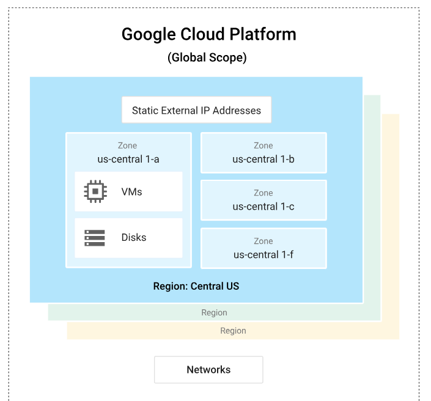
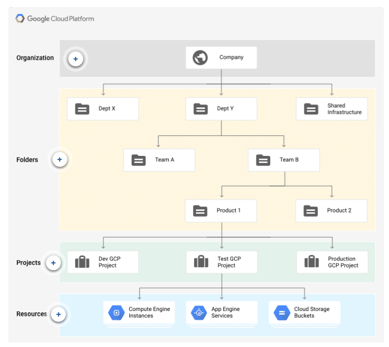

### Week 9 - GCP Fundamentals Part 1: Core Concepts

* **What is GCP?**
* **Global, regional, and zonal resources**
* **Ways to interact with the services**
    - Google Cloud Console
    - Command-line interface
* **Resource hierarchy**
    - Organization
    - Folders
    - Projects
    - Resources
* **Computing and hosting services**
    - Serverless computing
    - Application platform
    - Virtual machines

# What is GCP?

https://www.youtube.com/watch?v=4D3X6Xl5c_Y

Google Cloud consists of a set of physical assets, such as computers and hard disk drives, and virtual resources, such as virtual machines (VMs), that are contained in Google's data centers around the globe.

The distribution of resources provides several benefits, including redundancy in case of failure and reduced latency by locating resources closer to clients. This distribution also introduces some rules about how resources can be used together.

# Global, regional, and zonal resources

Some resources can be accessed by any other resource, across regions and zones. These global resources include preconfigured disk images, disk snapshots, and networks. 

Some resources can be accessed only by resources that are located in the same region. These regional resources include static external IP addresses. 

Other resources can be accessed only by resources that are located in the same zone. These zonal resources include VM instances, their types, and disks.



The  diagram shows the relationship between global scope, regions and zones, and some of their resources


## Geography and regions

Google Cloud services are available in locations across North America, South America, Europe, Asia, and Australia. These locations are divided into regions and zones. You can choose where to locate your applications to meet your latency, availability, and durability requirements.

A zone is a deployment area for Google Cloud resources within a region. Zones should be considered a single failure domain within a region. To deploy fault-tolerant applications with high availability and help protect against unexpected failures, deploy your applications across multiple zones in a region.

To protect against the loss of an entire region due to natural disaster, have a disaster recovery plan and know how to bring up your application in the unlikely event that your primary region is lost.


# Ways to interact with the services

### Google Cloud Console

The Google Cloud Console provides a web-based, graphical user interface that you can use to manage your Google Cloud projects and resources. When you use the Cloud Console, you create a new project, or choose an existing project, and use the resources that you create in the context of that project. 

You can create multiple projects, so you can use projects to separate your work in whatever way makes sense for you. 

### Command-line interface

If you prefer to work at the command line, you can perform most Google Cloud tasks by using the gcloud command-line tool. The gcloud tool lets you manage development workflow and Google Cloud resources in a terminal window.

For example, you can create a new Compute Engine virtual machine named example-instance using a command like the following example:

```
gcloud compute instances create example-instance \
--image-family=rhel-8 \
--image-project=rhel-cloud\
    --zone=us-central1-a
```

You can run **gcloud** commands in the following ways:

* You can install the Cloud SDK. The SDK includes the gcloud tool, so you can open a terminal window on your own computer and run commands to manage Google Cloud resources.
* You can use Cloud Shell, which is a browser-based shell. Because it runs in a browser window, you don't need to install anything on your own computer. You can open the Cloud Shell from the Google Cloud Console.


# Resource hierarchy

The Google Cloud resource hierarchy resembles the file system found in traditional operating systems as a way of organizing and managing entities hierarchically. Each resource has exactly one parent. This hierarchical organization of resources enables you to set access control policies and configuration settings on a parent resource, and the policies and Identity and Access Management (IAM) settings are inherited by the child resources



### Organization
The Organization resource is the root node of the Google Cloud resource hierarchy and all resources that belong to an organization are grouped under the organization node.

### Folders
Folders are an additional grouping mechanism on top of projects. 
You are required to have an Organization resource as a prerequisite to use folders. 
Folders and projects are all mapped under the Organization resource.

### Projects
The project resource is the base-level organizing entity. 
Organizations and folders may contain multiple projects. A project is required to use Google Cloud, and forms the basis for creating, enabling, and using all Google Cloud services, managing APIs, enabling billing, adding and removing collaborators, and managing permissions.

### Resources
At the lowest level, resources are the fundamental components that make up all Google Cloud services. Examples of resources include Compute Engine Virtual Machines (VMs), Pub/Sub topics, Cloud Storage buckets, App Engine instances.
 
----

Google Cloud users are not required to have an Organization resource, but some features of Resource Manager will not be usable without one.

When it comes to projects, there are some keypoints to remember. Each Google Cloud project has the following:

* A project name, which you provide.
* A project ID, which you can provide or Google Cloud can provide for you.
* A project number, which Google Cloud provides.

As you work with Google Cloud, you'll use these identifiers in certain command lines and API calls. The following screenshot shows a project name, its ID, and number:

<!-- picture -->

In this example:

* Example Project is the project name.
* example-id is the project ID.
* 123456789012 is the project number.


Each project ID is unique across Google Cloud. Once you have created a project, you can delete the project but its ID can never be used again.

When billing is enabled, each project is associated with one billing account. Multiple projects can have their resource usage billed to the same account.

A project serves as a namespace. This means every resource within each project must have a unique name, but you can usually reuse resource names if they are in separate projects. 

**Some resource names must be globally unique.**


# Computing and hosting services

Google Cloud gives you options for computing and hosting. You can choose to do the following:

* Work in a serverless environment.
* Use a managed application platform.
* Leverage container technologies to gain lots of flexibility.
* Build your own cloud-based infrastructure to have the most control and flexibility.


### Serverless computing
**Cloud Functions**, provides a serverless execution environment for building and connecting cloud services. With Cloud Functions you write simple, single-purpose functions that are attached to events emitted from your cloud infrastructure and services.

Cloud Functions can be written using JavaScript, Python 3, Go, or Java. You can take your function and run it in any standard Node.js (Node.js 10), Python 3 (Python 3.7), Go (Go 1.11 or 1.13) or Java (Java 11) environment, which makes both portability and local testing a breeze

### Application platform
App Engine is Google Cloud's platform as a service (PaaS). With App Engine, Google handles most of the management of the resources for you. For example, if your application requires more computing resources because traffic to your website increases, Google automatically scales the system to provide those resources. If the system software needs a security update, that's handled for you, too.

When you build your app on App Engine, you can:

* Build your app in Go, Java, .NET, Node.js, PHP, Python, or Ruby and use pre-configured runtimes, or use custom runtimes to write code in any language.
* Let Google manage app hosting, scaling, monitoring, and infrastructure for you.
* Connect with Google Cloud storage products, such as Cloud SQL, Firestore in Datastore mode, and Cloud Storage. You can also connect to managed Redis databases, and host third-party databases such as MongoDB and Cassandra on Compute Engine, another cloud provider, on-premises, or with a third-party vendor.
* Use Web Security Scanner to identify security vulnerabilities as a complement to your existing secure design and development processes.


### Virtual machines
Google Cloud's unmanaged compute service is Compute Engine. You can think of Compute Engine as providing an infrastructure as a service (IaaS), because the system provides a robust computing infrastructure, but you must choose and configure the platform components that you want to use. With Compute Engine, it's your responsibility to configure, administer, and monitor the systems. 
When you build on Compute Engine, you can do the following:

* Use virtual machines (VMs), called instances, to build your application, much like you would if you had your own hardware infrastructure. 
* Choose which global regions and zones to deploy your resources in, giving you control over where your data is stored and used.
* Choose which operating systems, development stacks, languages, frameworks, services, and other software technologies you prefer.
* Create instances from public or private images.
* Use Google Cloud storage technologies or any third-party technologies you prefer.
* Use Google Cloud Marketplace to quickly deploy pre-configured software packages. For example, you can deploy a LAMP or MEAN stack with just a few clicks.
* Create instance groups to more easily manage multiple instances together.
* Use autoscaling with an instance group to automatically add and remove capacity.
* Attach and detach disks as needed.
* Use SSH to connect directly to your instances.