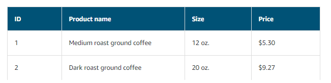
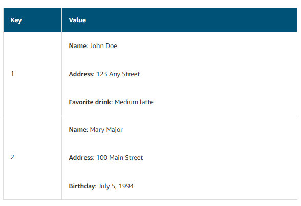

# Week 12  AWS Fundamentals Part 2: Storage and Compute Services

* Database Services
    - Relational Database  vs Non-relational Databases
    - Amazon Relational Database Service
    - Amazon DynamoDB
    - Other Database Services

* Storage Services
    - Amazon S3
    - Amazon Elastic Block Store
    - Amazon Elastic File System

* GCP Networking Services
    - Virtual Private Cloud (VPC)
    - Firewall rules
    - Routes
    - Load balancing
    - Cloud DNS
    - Advanced connectivity

## Database Services

AWS databases are built for business-critical, enterprise workloads, offering high availability, reliability, and security. These databases support multi-region, multi-master replication, and provide full oversight of your data with multiple levels of security, including network isolation, and end-to-end encryption.

### Relational Database  vs Non-relational Databases

| Relational database                                                                                                                                                                                         | Non-relational Databases                                                                                                                                                                                                           |
| ----------------------------------------------------------------------------------------------------------------------------------------------------------------------------------------------------------- | ---------------------------------------------------------------------------------------------------------------------------------------------------------------------------------------------------------------------------------- |
| In a relational database, data is stored in a way that relates it to other pieces of data.                                                                                                                  | In a non-relational database, you create tables. A table is a place where you can store and query data.                                                                                                                            |
| An example of a relational database might be the coffee shop’s inventory management system. Each record in the database would include data for a single item, such as product name, size, price, and so on. | Non-relational databases are sometimes referred to as “NoSQL databases” because they use structures other than rows and columns to organize data. One type of structural approach for non-relational databases is key-value pairs. |
| Relational databases use structured query language (SQL) to store and query data. This approach allows data to be stored in an easily understandable, consistent, and scalable way.                         | In a key-value database, you can add or remove attributes from items in the table at any time. Additionally, not every item in the table has to have the same attributes.                                                          |

https://www.youtube.com/watch?v=AbhnNqlOYWY

### Amazon Relational Database Service

Amazon Relational Database Service (Amazon RDS) is a service that enables you to run relational databases in the AWS Cloud.
Amazon RDS is a managed service that automates tasks such as hardware provisioning, database setup, patching, and backups. With these capabilities, you can spend less time completing administrative tasks and more time using data to innovate your applications. 
You can integrate Amazon RDS with other services to fulfill your business and operational needs, such as using AWS Lambda to query your database from a serverless application.
Supported database engines include:

* Amazon Aurora
* PostgreSQL
* MySQL
* MariaDB
* Oracle Database
* Microsoft SQL Server

### Amazon DynamoDB

Amazon DynamoDB is a key-value database service. It delivers single-digit millisecond performance at any scale.

* DynamoDB is serverless, which means that you do not have to provision, patch, or manage servers.
* You do not have to install, maintain, or operate software.
* As the size of your DB shrinks or grows, DynamoDB automatically scales to adjust for changes in capacity while maintaining consistent performance.
Example of data in a nonrelational database:

### Other Database Services
- Amazon Aurora is an enterprise-class relational database. It is compatible with MySQL and PostgreSQL relational databases. It is up to five times faster than standard MySQL databases and up to three times faster than standard PostgreSQL databases.
- Amazon Redshift is a data warehousing service that you can use for big data analytics. It offers the ability to collect data from many sources and helps you to understand relationships and trends across your data.
- Amazon ElastiCache is a service that adds caching layers on top of your databases to help improve the read times of common requests.
- Amazon Neptune is a graph database service.
You can use Amazon Neptune to build and run applications that work with highly connected datasets, such as recommendation engines, fraud detection, and knowledge graphs.

# Storage Services

AWS offers a complete range of services for you to store, access, govern, and analyze your data to reduce costs, increase agility, and accelerate innovation. Select from object storage, file storage, and block storage services, backup, and data migration options to build the foundation of your cloud IT environment.

### Amazon S3
https://www.youtube.com/watch?v=_I14_sXHO8U
Amazon Simple Storage Service (Amazon S3) is an object storage service that offers industry-leading scalability, data availability, security, and performance. This means customers of all sizes and industries can use it to store and protect any amount of data for a range of use cases, such as websites, mobile applications, backup and restore, archive, enterprise applications, IoT devices, and big data analytics. 

Amazon S3 provides easy-to-use management features so you can organize your data and configure finely-tuned access controls to meet your specific business, organizational, and compliance requirements. Amazon S3 is designed for 99.999999999% (11 9's) of durability, and stores data for millions of applications for companies all around the world.

### Amazon Elastic Block Store
https://www.youtube.com/watch?v=77qLAl-lRpo
Amazon Elastic Block Store (Amazon EBS) provides persistent block storage volumes for use with Amazon EC2 instances in the AWS Cloud. Each Amazon EBS volume is automatically replicated within its Availability Zone to protect you from component failure, offering high availability and durability. 

Amazon EBS volumes offer the consistent and low-latency performance needed to run your workloads. With Amazon EBS, you can scale your usage up or down within minutes—all while paying a low price for only what you provision.

### Amazon Elastic File System
https://www.youtube.com/watch?v=AvgAozsfCrY
Amazon Elastic File System (Amazon EFS) provides a simple, scalable, elastic file system for Linux-based workloads for use with AWS Cloud services and on-premises resources. It is built to scale on demand to petabytes without disrupting applications, growing and shrinking automatically as you add and remove files, so your applications have the storage they need – when they need it. 
It is designed to provide massively parallel shared access to thousands of Amazon EC2 instances, enabling your applications to achieve high levels of aggregate throughput and IOPS with consistent low latencies. Amazon EFS is a fully managed service that requires no changes to your existing applications and tools, providing access through a standard file system interface for seamless integration. 
Amazon EFS is a regional service storing data within and across multiple Availability Zones (AZs) for high availability and durability. You can access your file systems across AZs and regions and share files between thousands of Amazon EC2 instances and on-premises servers via AWS Direct Connect or AWS VPN.

---

**Do not mix Instance Store and EBS!**
**An instance store provides temporary block-level storage for an Amazon EC2 instance, while EBS provides block-level storage volumes which remains available even after terminating a ECS instance**

When it comes to S3, it offers different storage classes, the characteristics of each one are summarized below

| Storage Class                 | Characteristic 1                                        | Characteristic 2                                                                |
| ----------------------------- | ------------------------------------------------------- | ------------------------------------------------------------------------------- |
| S3 Standard                   | Designed for frequently accessed data                   | Stores data in a minimum of three Availability Zones                            |
| S3 Standard Infrequent Access | Ideal for infrequently accessed data                    | Similar to S3 Standard but has a lower storage price and higher retrieval price |
| S3 One Zone Infrequent Access | Stores data in a single Availability Zone               | Has a lower storage price than S3 Standard-IA                                   |
| S3 Intelligent-Tiering        | Ideal for data with unknown or changing access patterns | Requires a small monthly monitoring and automation fee per object               |
| S3 Glacier                    | Low-cost storage designed for data archiving            | Able to retrieve objects within a few minutes to hours                          |
| S3 Glacier Deep Archive       | Lowest-cost object storage class ideal for archiving    | Able to retrieve objects within 12 hours                                        |

# GCP Fundamentals Part 3: Network Services

## GCP Networking Services

While App Engine manages networking for you, and GKE uses the Kubernetes model, Compute Engine provides a set of networking services. These services help you to load-balance traffic across resources, create DNS records, and connect your existing network to Google's network.

### Virtual Private Cloud (VPC)
It provides a set of networking services that your VM instances use. An instance can have more than one interface, but each interface must be connected to a different network. 

Every VPC project has a default network. You can create additional networks in your project, but networks cannot be shared between projects.

A VPC network provides the following:

* Provides connectivity for your Compute Engine virtual machine (VM) instances, including Google Kubernetes Engine (GKE) clusters, App Engine flexible environment instances, and other Google Cloud products built on Compute Engine VMs.
* Offers built-in Internal TCP/UDP Load Balancing and proxy systems for Internal HTTP(S) Load Balancing.
* Connects to on-premises networks using Cloud VPN tunnels and Cloud Interconnect attachments.
* Distributes traffic from Google Cloud external load balancers to backends.

### Firewall rules
VPC firewall rules let you allow or deny connections to or from your virtual machine (VM) instances based on a configuration that you specify. Enabled VPC firewall rules are always enforced, protecting your instances regardless of their configuration and operating system, even if they have not started up.

Every VPC network functions as a distributed firewall. While firewall rules are defined at the network level, connections are allowed or denied on a per-instance basis. 
You can think of the VPC firewall rules as existing not only between your instances and other networks, but also between individual instances within the same network.

### Routes
Google Cloud routes define the paths that network traffic takes from a virtual machine (VM) instance to other destinations. These destinations can be inside your Google Cloud Virtual Private Cloud (VPC) network (for example, in another VM) or outside it.
In a VPC network, a route consists of a single destination prefix in CIDR format and a single next hop. When an instance in a VPC network sends a packet, Google Cloud delivers the packet to the route's next hop if the packet's destination address is within the route's destination range.

### Load balancing
If your website or application is running on Compute Engine, the time might come when you're ready to distribute the workload across multiple instances. Server-side load balancing features provide you with the following options:

* Network load balancing lets you distribute traffic among server instances in the same region based on incoming IP protocol data, such as address, port, and protocol. 
* HTTP(S) load balancing enables you to distribute traffic across regions so you can ensure that requests are routed to the closest region or, in the event of a failure or over-capacity limitations, to a healthy instance in the next closest region.

### Cloud DNS
Cloud DNS is a high-performance, resilient, global Domain Name System (DNS) service that publishes your domain names to the global DNS in a cost-effective way.
DNS is a hierarchical distributed database that lets you store IP addresses and other data, and look them up by name. Cloud DNS lets you publish your zones and records in DNS without the burden of managing your own DNS servers and software.
Cloud DNS offers both public zones and private managed DNS zones. A public zone is visible to the public internet, while a private zone is visible only from one or more Virtual Private Cloud (VPC) networks that you specify.

### Advanced connectivity
If you have an existing network that you want to connect to Google Cloud resources, Google Cloud offers the following options for advanced connectivity:

- **Cloud Interconnect** enables you to connect your existing network to your VPC network through a highly available, low-latency, enterprise-grade connection. 
- **Cloud VPN** enables you to connect your existing network to your VPC network through an IPsec connection. You can also use VPN to connect two Cloud VPN gateways to each other.
- **Direct Peering** enables you to exchange internet traffic between your business network and Google at one of Google's broad-reaching edge network locations. See Google's peering site for more information about edge locations.
- **Carrier Peering** enables you to connect your infrastructure to Google's network edge through highly available, lower-latency connections by using service providers.